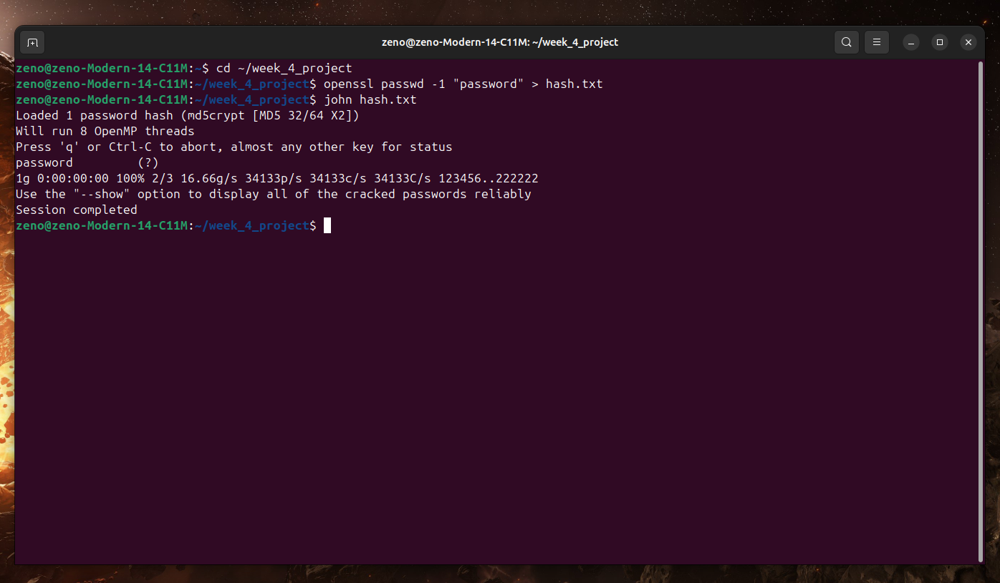

# Week 4 Internship Projects
**Intern:** Sheikh Junayed Ahmed  
**Program:** M.Sc. Cyber Security, Amity University Bengaluru  
**Company:** Codec Technologies  

## Project Overview
This repository contains the "Week 4" internship deliverables.

### 1. Cryptography Algorithms Implementation
- **File:** `hybrid_crypto.py`
- **Objective:** Implement popular cryptography algorithms like AES and RSA to understand encryption and decryption processes.
- **Tools:** Python (PyCryptodome).
- **Outcome:** Successfully created a hybrid encryption system for secure communication.

### 2. Password Cracking and Hashing Algorithms
- **Files:** `password_security.py`, `simple_cracker.py`
- **Objective:** Analyze and implement brute-force password cracking tools while understanding hash functions and salting techniques.
- **Tools:** Python, John the Ripper.
- **Outcome:** 1. **Hashing:** Demonstrated the security difference between SHA-256 and salted Bcrypt.
  2. **Cracking:** Used **John the Ripper** and custom scripts to demonstrate dictionary attacks.

### Proof of Concept: John the Ripper

## How to Run
1. **Install Requirements:** `pip install -r requirements.txt`
2. **Run Encryption:** `python3 hybrid_crypto.py`
3. **Run Hashing Analysis:** `python3 password_security.py`
4. **Run Brute-Force Demo:** `python3 simple_cracker.py`
